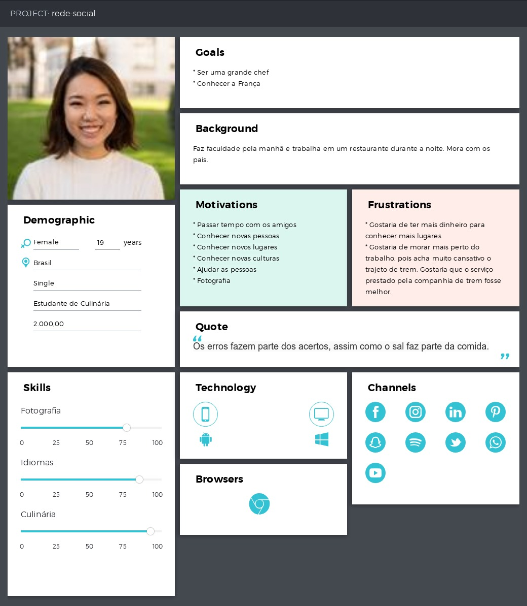

# SerView
Projeto rede social <Laboratoria>

## Índice

* [Definição do produto](#definição-do-produto)
* [Pesquisa com usuários](#Pesquisa-com-usuários)
* [Personas](#personas)
* [Histórias de usuário](#Histórias-de-usuário)
* [Protótipo](#protótipo)
* [Testes de usabilidade](#testes-de-usabilidade)
* [Planejamento e design sprint](#Planejamento-e-design-sprint)

[Link da aplicação](https://hlays.github.io/redesocial/)

## Definição do produto

## Pesquisa com usuários

## Personas

**Elis**

**Flora**

**Mateus**

## Histórias de usuário

1. Eu como usuário gostaria de ter opções de validações diversas ao fazer login.
2. Eu como usuária gostaria de saber quando esqueci de preencher campos de login.
3. Eu como usuário gostaria de postar um texto sem limites de caracteres.
4. Eu como usuária gostaria de sugestão do que postar na rede social.
5. Eu como usuário quero que meus posts possam ser públicos ou privados.
6. Eu como usuária gostaria de fazer o meu cadastro em uma nova rede social de forma rápida, simples e fácil
7. Eu como usuária gostaria de visualizar quantas pessoas concordam com determinada avaliação (além de gostei, curtir, ter a opção "concordo" com essa avaliação, para forma de dar credibilidade para aquela avaliação também)
8. Eu como usuária gostaria de avaliar de forma rápida, simples e fácil (por exemplo por estrelas, mas também com opção de relato textual da experiência)
9. Eu como usuária gostaria de ter acesso, no primeiro momento, somente das avaliações que mais têm "concordo"
10. Eu como usuária, gostaria de seguir alguns usuários e visualizar suas publicações (amigos), vice versa

## Protótipo

O protótipo da Serview, pode ser visualizado no link abaixo:
[Protótipo da aplicação](https://marvelapp.com/4h44fca)

## Testes de usabilidade

## Planejamento e design sprint